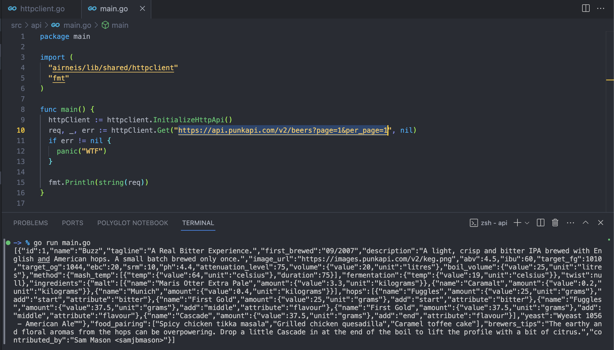

# Our Http Client

This client will be useful when we need to make http requests when making our custom APIs in which providers don't have a Golang Client for their product.

## How to use it

- Initialize the client
  When you need to use the client, you need to make that the Http Client has initialized at least once inside the app before the making the fiber app. (This will be done in this PR : https://github.com/KrispyTech/airneis/pull/19)

```go
httpClient := httpClient.InitializeHttpApi()
```

When you the client is initialized, you'll be able to make requests like this :

```go
req, status, err := httpClient.Get("https://api/punkapi.com/v2/beers?page=1&per_page=1", nil)
if err != nil {
  return nil, 0, err
}

fmt.Println(string(req))
fmt.Printf("Status Code : %s", status)
```

## Example :



The client can be subject to be upgraded anytime.
