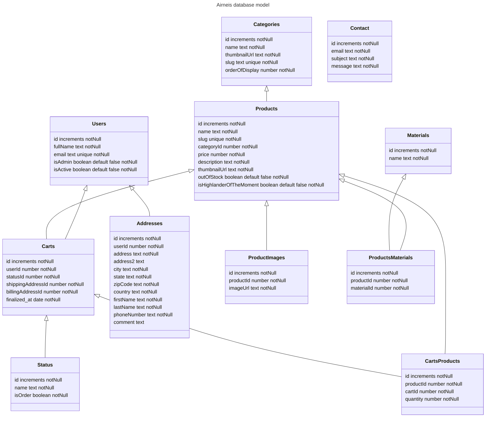

# Schema

# Explanation

## Users

This class represents the user whether he is admin or not.
We ask for his email and phone number to be able to contact him for commercials offers and for updates on his orders.

## Categories

Each category has a name, a thumbnail and a slug this slug should be the category's name in lowercase and if the category is in multiple words,each space should be replace by a dash .
The slug should be unique as we will use it in the urls to identify specific category.

## Products

As for the category each product will have a slug that follows the same rules as the category's slug.
The description is mandatory as the risk to create confusion for the client is too high without description.
ThumbnailUrl is the url of the image that will be displayed on the category page.

## ProductImages

This represents the images of the product that will be displayed on product page in carousell.

## Carts

This table will represent both carts and orders.
The status will differentiate between the two.

## CartsProducts

This table links the products and the carts.
When a user add a product to his cart, we will create a new row in this table.

## Status

The status represents the lifecycle of the cart.
The isOrder field says if the cart is an order or not.
If it's an order it means that it has been paid and that it will be delivered.

## Addresses

Can be both shipping or billing address.
The comment is optional and can be used to give more information about the address for the delivery person.
The zipCode is a string because some countries have letters in their zipCode.

# Contact

This table represents the contact form.
The content of this table will be displayed in backoffice.
