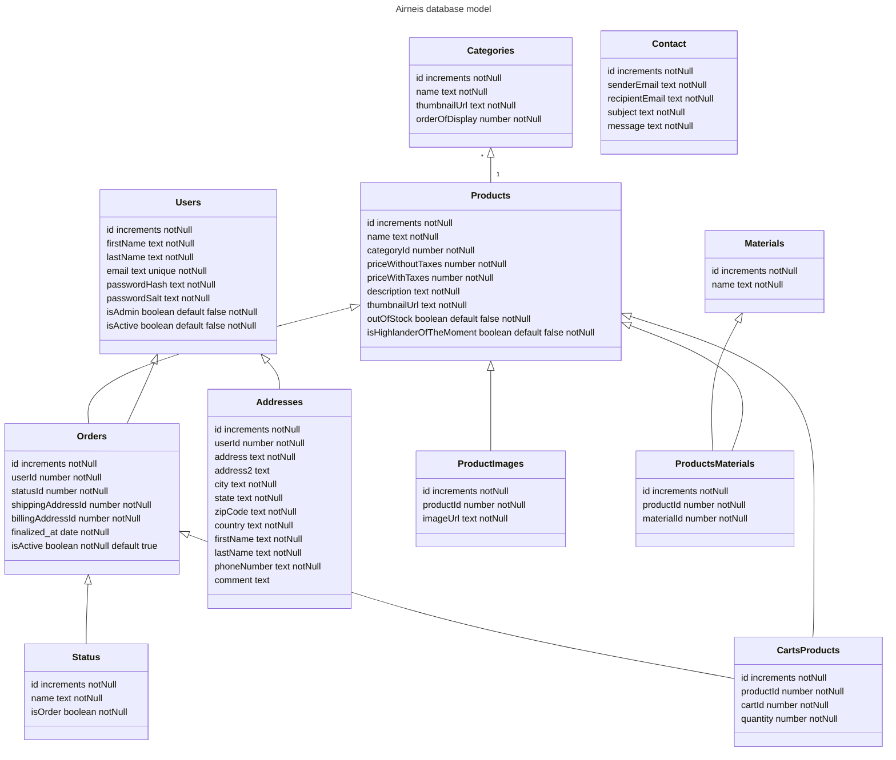

# Schema

# Explanation

## Users

This class represents the user whether he is admin or not.
We ask for his email and phone number to be able to contact him for commercials offers and for updates on his orders.
The email will also be the logg in field
For more safety we the password is hashed and we have one salt per user

## Categories

Each category has a `name`, and a`thumbnail` .
`orderOfDisplay` represents the order in which the categories will be displayed on home page as it must be configurable
in back office

## Products

The `description` is mandatory as the risk to create confusion for the client is too high without description.
`ThumbnailUrl` is the url of the image that will be displayed on the category page.

## ProductImages

This represents the images of the product that will be displayed on product page in carousel.

## Materials

As we have to be able to filter products per material we store it into database to make the filtering easier.

## ProductsMaterials

As it's a many relation we have to create a link table between products and materials

## Orders

This table will represent both carts and orders.
The `status` will differentiate between the two.

## CartsProducts

This table links the products and the carts.
When a user add a product to his cart, we will create a new row in this table.
As it's a one to many between cart and products we have to create a link table.

## Status

The status represents the lifecycle of the cart.
The `isOrder` field says if the cart is an order or not.
If it's an order it means that it has been paid and that it will be delivered.

## Addresses

Can be both shipping or billing address.
The `comment` is optional and can be used to give more information about the address for the delivery person.
The `zipCode` is a string because some countries have letters in their zipCode.
The `isActive` field is for history purpose. When an address is updated a new row should be created in the database.
This row should be a "clone" with the new information. This will avoid to affect the addresses used in past Orders.

# Contact

This table represents the contact form.
The content of this table will be displayed in backoffice.
The `senderEmail` represent the email of the people who write to us
The `recipientEmail` email represents the email of our company as we may send ourselves an email to keep another track
of every contacts
