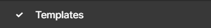

# Figma Link

[Figma link](https://www.figma.com/file/tqpdNMq2MpwY135z4RKXi3/AIRNEIS?type=design&node-id=39%3A1014&mode=design&t=nh2gdlrOpHCehg5D-1)

# Brief Presentation

_In Figma project, the are three unique pages:_

## Templates

A page containing all the templates we need to use:  fonts, logo, colors, and icons.
This is the basis of the project, which introduces the main theme of our application and website.

## Components

A page containing all the components needed to create a page.

## Pages

A page containing the website and mobile mock-ups.
A visual of each page in web and mobile are included.
