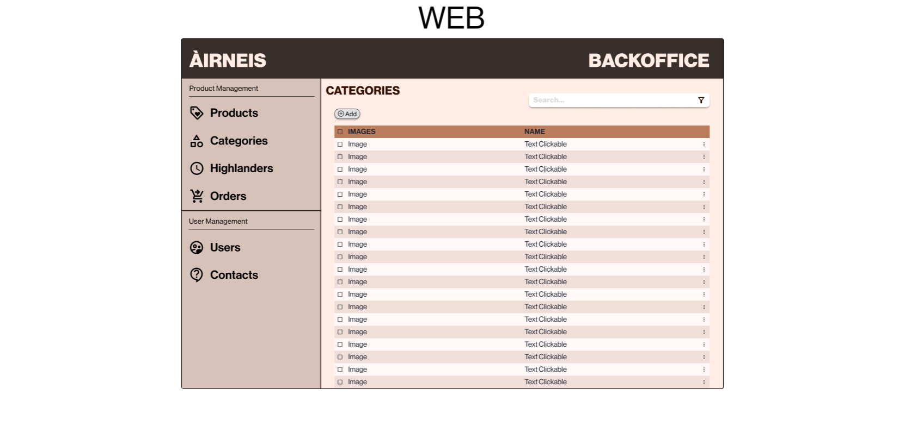
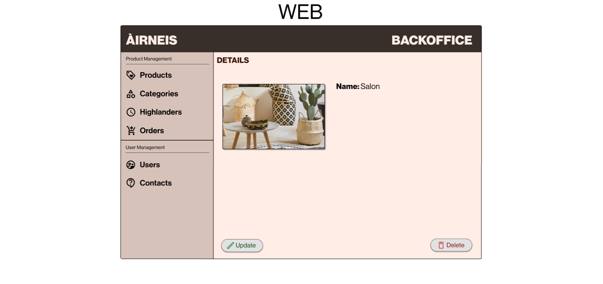
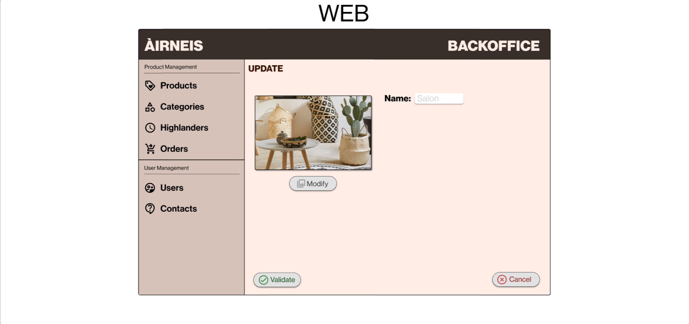
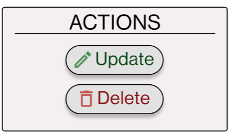
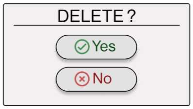
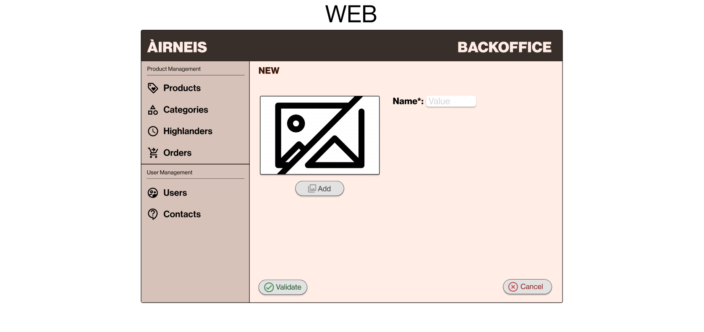

# Category Management

Category management contains a table of all the categories present on the web or mobile. Not all the information is displayed, just the main ones.

We can perform an advanced search to find a category, with the option of filtering it.

If we want to see all the information for a category, we can click on the clickable text.

Once we've clicked on it, another page opens:

The category details page contains all information on the category we have selected.

On this page, we can perform two actions:
- Update the category.
- Delete the category.

If we click on the update button we can see an other page:

As we can see in the mockup above, we can change the value of all the fields and change the category image.
We can click on the "yes" or "no" button to complete the changes.

We also have another way of updating or deleting one or more categories. If we press the three small dots in the table while selecting one or more categories, an "Actions" popup appears:
- If we click on the "Update" button, the page(s) for updating the information in one or more categories will open.
- If we click on the "Delete" button, the popup changes to give way to another popup where we can choose whether we want to delete the category or categories we have selected.

Actions popup:

Delete popup:

Finally, we have the option of adding a new category by pressing the "New" button.

A new page will appear with the option of adding an image and a name for the category:

