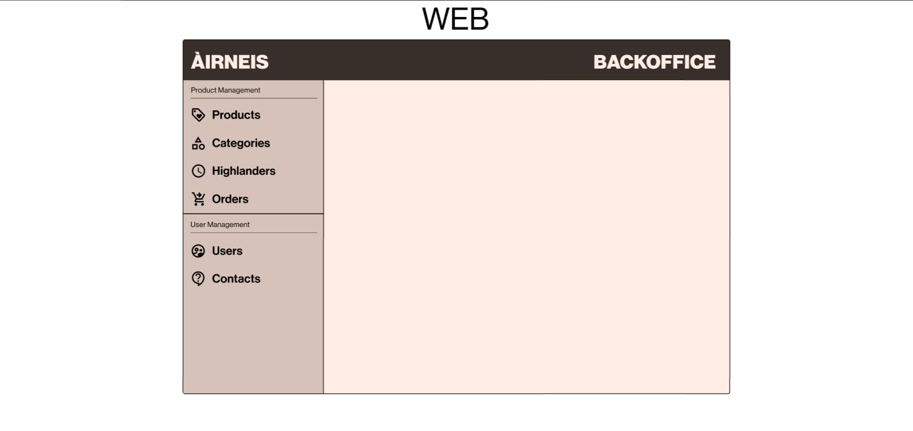

# Layout Mockup

This is the main layout that will be used for all other pages in our back-office.
We can see the header, which contains "ÀIRNEIS" and "Back Office".

There is also a lateral bar which contains all back office navigations

<<<<<<< Updated upstream
The first part of the lateral bar is for "Product Management":
- Products, to see all products in a table and manage them.
- Categories, to see all categories in a table and manage them.
- Higlanders, to manage "The Highlanders of the moment" in a table and choose the order in which they appear.
- Orders, to manage the orders in a table and manage them

The second part of the lateral bar is for "User Management":
- Users, to manage all users in a table that have a connection on the web or mobile.
- Contacts, to manage forms written by the users.
=======
The first part of the lateral bar is the "Product Management":
- Products: To see all products in a table and manage them.
- Categories: To see all categories in a table and manage them.
- Higlanders: To manage "The Highlanders of the moment" in a table and choose the order in which they appear.
- Orders: To manage the orders in a table and manage them

The second part of the lateral bar is the "User Management":
- Users: To manage all users in a table that have a connection on the web or mobile.
- Contacts: To manage forms written by the users.
>>>>>>> Stashed changes
