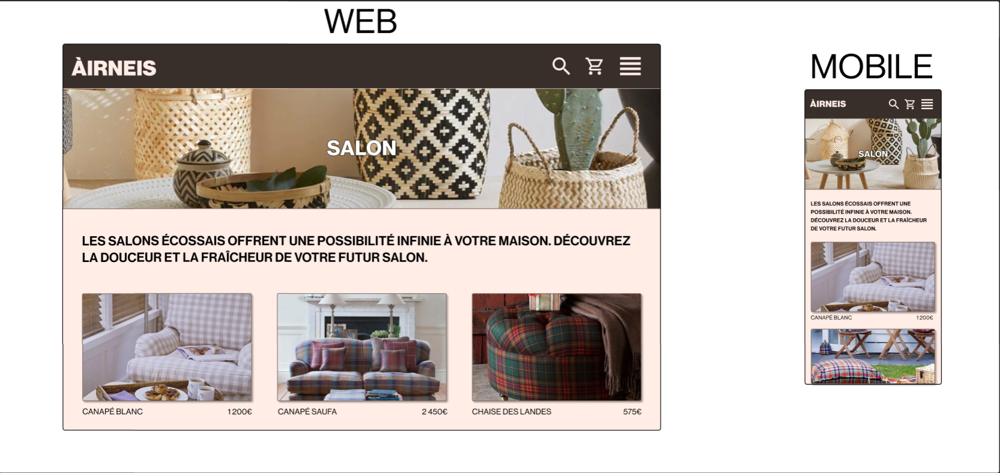

# Category Page Mockup

The category page is the first page containing the products you want to see or buy on the website or your mobile phone.

The first part of the mock-up is an image containing the category title:
- To check that we are in the category we want.

The second part of the mock-up represents the product sheets:
- Each sheet contains an image, a product name and a price.

On this page, we can see all the products in a category and choose the product we want to see or buy for more details.
