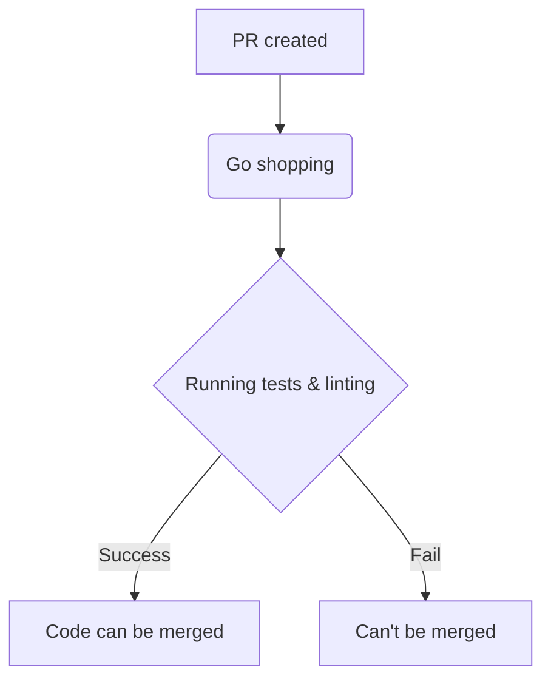

# TITLE: Set up our first Github Action

Author : Barnabé PILLIAUDIN
Date : 2024-01-24

## SUMMARY:

We want to have our code linted and tested automatically when pushed. As our code is hosted on Github, we will use Github Actions to do so.

## CONTEXT:

Having code linted and tested is a good practice and will help us maintain a clean and working codebase. It would be done automatically when the code is pushed to be sure that the code merging into staging will work and be clean. It will also help the reviewers.

## SOLUTION:

GitHub offers a solution for that called Github Actions.
Here is the pricing for Github Actions:

As we are a free organization, we have 2000 free minutes per month. Which is almost 34 hours and a should be a bit more than 600 runs per month.
With the first run of the pipeline, it looks unlikely that a run would last more that 3 minutes. If you divide 2000 by 3, you get around 650 runs per month. Which looks enough if used wisely.

We will run the linter for back with a default configuration of golangci-lint (you can find the documentation below). ESlint for front and mobile, on every merge request and on push to staging or main. We will also run the tests for the backend.

https://golangci-lint.run/

