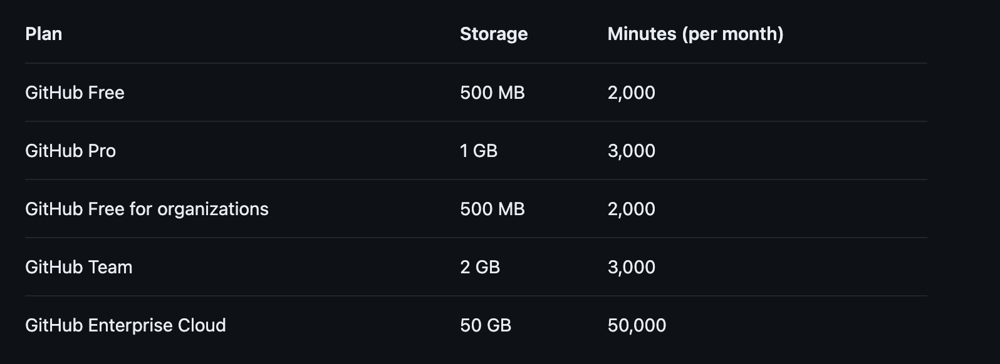

# TITLE: Set up our first Github Action

Author : Barnabé PILLIAUDIN
Date : 2024-01-24

## SUMMARY:

We wan to have our code linted and tested automatically when pushed. As we our code is hosted on Github, we will use Github Actions to do so.

## CONTEXT:

Having code linted and tested is a good practice and will help us maintaining a clean and working codebase. We it to be done automatically when code is push to be sure that the code merged into staging to be deployed is working and clean. It will also help the reviewers.

## SOLUTION:

GitHub offers a solution for that called Github Actions.
Here is the pricing for Github Actions:

As we are a free organization, we have 2000 free minutes per month. Witch is almost 34 hours and a should be a bit less than 400 runs per month.

We will run the linter and the test on every merge request.
