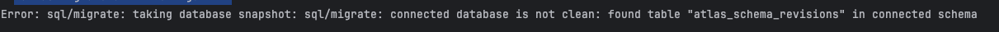

# WIP NOT FINISHED

# Configure gorm dive-in

Author : Barnabé PILLIAUDIN  
Co-Assignee: Cédric Gautier  
Date : 2024-02-07

## SUMMARY:
We want to declare a schema of our database and this schema to be applied to the database.
But we don't want it to be like dark magic. We want to have some control over it.
As we are using golang for our backend we think about using gorm and atlas to achieve that.

## SOLUTION:

Atlas offers a clean to do versioned migrations.

To declare your schema with gorm you can create a struct that represent a table where each attribute is a column.
That's a pretty nice way of declaring schema as we will be able to use those structs as our types.

```go
package model

import "gorm.io/gorm"

type User struct {
gorm.Model
Name    string `json:"name" gorm:"unique"`
Age     int    `json:"age"`
IsAdmin bool   `json:"isAdmin"`
}

type Car struct {
gorm.Model
Owner       User   `json:"owner" gorm:"-"`
Constructor string `json:"constructor"`
ModelName   string `json:"modelName"`
}
```

To make the migrations could use Atlas.

If we want to use Atlas we would need  to install it. 
To do so you can use homebrew for macos or your favorite package manager if you are using linux
To set it up create an ```atlas.hcl``` file following this example

```hcl

data "external_schema" "gorm" {
  program = [
    "go",
    "run",
    "-mod=mod",
    "ariga.io/atlas-provider-gorm",
    "load",
    "--path", "./model",
    "--dialect", "postgres", // | postgres | sqlite | sqlserver
  ]
}

env "gorm" {
  src = data.external_schema.gorm.url
  dev = "Your dev database uri" # Don't forget to add sslmode=disable if ssl is not enable and search_path=public as queries string
  url =  "Your database uri" # In local it can be the same url
  migration {
    dir = "file://migrations" 
  }
  format {
    migrate {
      diff = "{{ sql . \"  \" }}"
    }
  }
}


```

To create a migration run the following command

```shell
 atlas migrate diff  migration_name --env gorm   
```

To apply the migration run

```shell
atlas migrate apply --env gorm
```


### PROBLEMS with atlas

When trying to rollback a migration or trying to create a second migration I have this error



The best I was able to do was to clear all the database  by running this command

```shell 
atlas schema clean -u "dburi"
```

### Solution 

After some discutions with a teacher and go developers it seems that's gorm automigrate would be 
enough for our project. If needed we can still create SQL script to correct things that automigrate would have done wrong.
It has the advantage that the migrations will be applied each time that the api is started so we won't need to modify 
the Dockerfile


## Useful links
- Atlas documentation: https://atlasgo.io/
- Gorm documentation: https://gorm.io/docs/


# Conclusion

We will be using GORM as our orm and query builder and migration engine. 
We won't have versioned migrations as we planed to have but automatic migrations.
It will be easier for us to work with and is enough for ou usage.