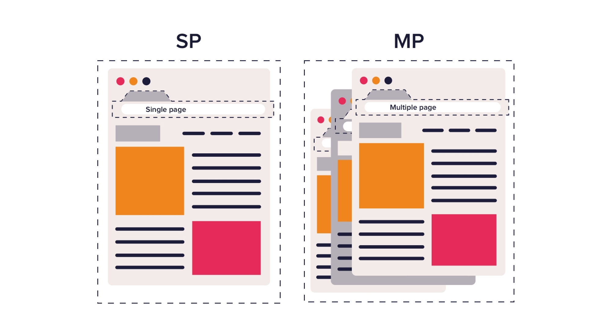

| Author         | Cedric Gautier |
| -------------- | -------------- |
| Data Started   | 05-11-2023     |
| Data Published | 20-11-2023     |

# Summary

We want to define the architecture for an application that we'll be making from the ground up. This application focuses around selling products on a websites.

# Context

- E-Commerce : Airneis

---

# Our Tech Stack

## Front-End

### Context

This part of the stack controls the data that is displayed on our app, we'll need a library for building user interfaces for our users.

### Web

#### Solution

We'll be using NextJS for these main reasons :

- We can create our custom components, which we'll need when creating in our app as we are asked to have our own Design System.
- NextJS uses an Single Page Application to speed up processing

##### Single Page Application and Multi Page Application differences

The image above shows the difference between a SPA and an MPA. You can see that the MPA reloads the entire page for each tab. In our case, **React JS** with **NextJS** uses the SPA to avoid reloading the page between each tab with the use of the Virtual DOM which allows to change just the difference between the current state and the previous state. The image below represents how the virtual dom works.

##### Project Scaffolding

> The scaffolding of our project is the the file system of our repository

###### Routing

We'll be using NextJS' App Router instead of using the Pages Router to adopt the new routing system of NextJS but it's **good to know** that it can work both alongside each other but the App Router takes priority over the Pages Router in the case there is a duplicate page.

- Possibility to have dynamic routes in the case we need to have a page for a specific type of object `eg: [nameOfComponent].js

**Notes :**

- To add a global component in the app that will be available on each page, we'll have to place the react component function in `_document.js`

### Mobile

#### Solution

We'll be using NativeWind. NativeWind uses Tailwind CSS as scripting language to create a universal style system for React Native. NativeWind components can be shared between platforms and will output their styles as CSS StyleSheet on web and StyleSheet.

---

## Back-End

### Context

This part of the stack controls the data traffic of our app, meaning how data is fetched, pushed, modified or deleted on our database. We'll need a Web Framework to build an API, a database and possibly an ORM to have a bridge from native SQL queries to our selected language.

In our case, we need backend that is blazing fast with the best support on large amounts of traffic. We are junior developers, so let's take an approach of simplicity and minimalism for the structure of our code and have an expressive way of coding for easy reading.

#### Solution

Creating an app can be a big challenge I would like for us to have a philosophy on exactly what's happening in our code.

To make it as explicit as possible, knowing what type(s) of variable(s) enters a function and what it type(s) it returns to be able to have the best comprehension of how everything works.

> \*Go was designed at [Google](https://en.wikipedia.org/wiki/Google "Google") in 2007 to improve [programming productivity](https://en.wikipedia.org/wiki/Programming_productivity "Programming productivity") in an era of [multicore](https://en.wikipedia.org/wiki/Multi-core_processor "Multi-core processor"), [networked](https://en.wikipedia.org/wiki/Computer_network "Computer network") [machines](https://en.wikipedia.org/wiki/Computer "Computer") and large [codebases](https://en.wikipedia.org/wiki/Codebase "Codebase"). The designers wanted to address criticism of other languages in use at Google, but keep their useful characteristics

Go is easily picked up as the language is similar to Python and C, to easily define the language it's like Python and C made a baby having in mind performance (performance of C) without the cost of code complexity (easy to read like Python).

The founders took the best of both worlds, having in mind a simple, efficient statically typed language with reduced complexity.

Words from a JS developer who switched to Golang - [Steve Hook](https://steevehook.medium.com/my-journey-from-javascript-to-go-9fb1e5d49fc2):

> Go is **transparent**, it’s plain & simple, sometimes really stupid, which makes no place for **gotchas** and **magical code**, which is a norm in dynamic languages such as JavaScript. With this mindset, and having some experience in this language

Fun fact, a famous and respected developer named TJ Holowaychuk, who has contributed to multiple open-source projects for the JavaScript community made the switch to Go and contributed to the Go projects.

#### Web Framework

**Fiber** is an [Express](https://github.com/expressjs/express) inspired **web framework** built on top of [Fasthttp](https://github.com/valyala/fasthttp), the **fastest** HTTP engine for [Go](https://go.dev/doc/). Designed to **ease** things up for **fast** development with **zero memory allocation** and **performance** in mind.

- Fastest Golang Web Framework
- Fiber is using HTTP1.1 Natively but support for [HTTP2 is possible](https://github.com/gofiber/fiber/pull/1688)
  - [FastHttp has no plans to support HTTP2 in the future](https://github.com/valyala/fasthttp/issues/144#issuecomment-1668764925)
    - [This is why](https://github.com/valyala/fasthttp/issues/144#issuecomment-1668501217)
      - But we may be able to do something with Cloudflare as it suppport

With our team having some experience with the Express Framework, this will be an easy transition on using Fiber. Everything is practically the same but we'll be using the Go language.

Additional information about **Fiber** :

- [Package Scores](https://snyk.io/advisor/golang/github.com/gofiber/fiber/v2)
- [Fiber Tutorial](https://dev.to/koddr/welcome-to-fiber-an-express-js-styled-fastest-web-framework-written-with-on-golang-497)
- [Express beaten by Fiber, article with benchmarks](https://dev.to/koddr/are-sure-what-your-lovely-web-framework-running-so-fast-2jl1)
- [Fiber Welcome Page](https://gofiber.io/)
- [Fiber Documentation](https://docs.gofiber.io/)

ORM:

## Infrastructure & Security

#### Database

We'll use a relational database in order to be able to relate one object to establish links or relationships–between information by joining tables, which makes it easy to understand and gain insights about the relationship between various data points.

##### SQL or PostgreSQL ? Which one should we choose

Microsoft SQL is a product owned by Microsoft, SQL Server is available for use through a commercial core-based license as a Standard or Enterprise edition with prices ranging from $3,586 to $13,748. There are also two free versions, a full-featured edition for developers available for non-production workloads and a free Express edition with limited features and database sizes.

PostgreSQL is open source, released under the PostgreSQL License. This means there is no fee for using this product for any purpose, including commercial use. According to the [PostgreSQL Global Development Group](https://www.postgresql.org/about/licence/), PostgreSQL will remain free and open source in perpetuity and there are no plans to change the license or release the product under a different license.

##### Solution

With the intent or our product being commercialised, having PostgreSQL will reduce our cost fees as **there is no fee** for use in commercial software products.

### Deployment

TBD

### Securing our Web Server

**Bonus :**

- Add Cloudflare in front of web server to block for unwanted traffic and limit any DDOS Attack

### Securing our CI/CD

Add a CI to be integrated before being able to merge requests - Add lingting check : Custom JS Lint and golangci-lint - Add testing phase (optionnal) - Gingko & Gomega go test ../ - Add injection on required environnement variables from `CI Variables` - Add secret detection phase

**Bonus :**

- Enable Commit Signing rules on our Github
- Add renovate-bot to be able to update vulnerable Go & NPM packages
- Add mobile testing requirement

# Quick notes :

- Think of what is the cost, what is the environnement and what you're really going to be end up doing. Better to know your environnement and product before pushing something you'll regret.
- You need a migration service for your PostgreSQL database, Do not use vanilla SQL
- Creating a CI with an amazing pipeline has bonus points
- Use of containers to be able to deploy and dev comfortably
- You are going to need to Use NEON, a serverless function for PostgreSQL
- We could use [Storybook](https://storybook.js.org/) to build UI components and pages in isolation.
- We could get secrets securely if needed on docker containers by fetching them from Hashicorp Vault

### Recap

- Frontend : Javascript - NextJS
- Backend : Go - Fiber
- Mobile : NativeWind (Tailwind with React Native)
- Database : PostgreSQL
- VCS : [Github](https://github.com/krispytech.airneis)
- CI/CD : Github Actions
- Storage : TBD
- Secret Management : Hashicorp Vault
- Web Proxy : Cloudflare (probably if needed)
- Deployment : TBD

This documentation may be subject to modifications by the author for future references. Get the latest version of this page by clicking on this [link]()
