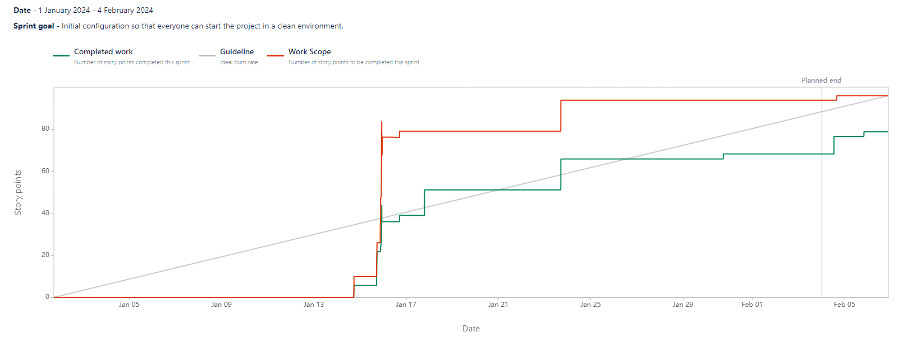

# Sprint N°1 [01/01/2024 - 04/02/2024]

_Initial configuration so that everyone can start the project in a clean environment._

## Positive reviews

- Review 1

  - Description: A dynamic, motivated team that does its utmost to give the best of itself.
  - Commitment:
    - Said by: Barnabé
    - What: Continuing in this direction.
    - When: Until the end of the project.

- Review 2

  - Description: The use of Jira was very much appreciated and enabled us to get tasks organised.
  - Commitment:
    - Said by: Kylian
    - What: Continue to use Jira seriously and update Jira regularly to keep it well organised at all times.
    - When: Until the end of the project.

- Review 3

  - Description: Numerous investments in new technologies. Discovering and mastering new technologies that add value to the project.
  - Commitment:
    - Said by: Cédric
    - What: Continue to be curious and courageous.
    - When: Until the end of the project.

## Negative reviews

- Review 1

  - Description: Atlas and Ent have not been configured on time.
  - Consequences: Delays in database and backend development.
  - Commitment:
    - Said by: Barnabé
    - What: Try to complete these configurations quickly in the next Sprint.
    - When: 05/02/2024 - 11/02/2024

- Review 2

  - Description: Difficulties getting Docker to work within the group.
  - Consequences: All the members of the team hadn't the same configuration.
  - Commitment:
    - Said by: Magali
    - What: This problem has been resolved by pushing a patch that works correctly.
    - When: During the first Sprint.

- Review 3

  - Description: Neon could not be deployed in time.
  - Consequences: An additional task for the next Sprint.
  - Commitment:
    - Said by: Magali
    - What: Try to complete these configurations quickly in the next Sprint.
    - When: 05/02/2024 - 11/02/2024

- Review 4

  - Description: Not enough responsiveness within the group on messages and communication.
  - Consequences: A feeling of loneliness and task awaiting an answer.
  - Commitment:
    - Said by: Cédric
    - What: Try to be more responsive to messages within 24 hours. Give more feedback and more concrete details.
    - When: During the next Sprint (#2).

- Review 5

  - Description: Always the same people reviewing.
  - Consequences: Always the same people taking part in the project.
  - Commitment:
    - Said by: Cédric
    - What: Try to be a little more diverse in the reviews. Make an effort.
    - When: During the next Sprint (#2).

## Questions

No questions for this Sprint.

## Ideas

- Idea 1

  - Description: Don't forget to regularly update the status of US or Tasks on Jira.
  - Commitment:
    - Said by: Kylian
    - What: When the Task or US has been finished, get into the habit of changing the status of this US or Task.
    - When: The next Sprint (#2).

- Idea 2

  - Description: Have the same group vision to work in good conditions.
  - Commitment:
    - Said by: Magali
    - What: Define the architecture in detail so, that everyone has the same vision, and develop in a clean, organised environment.
    - When: The next Sprint (#2).

- Idea 3

  - Description: Approve reviews by understanding the broad outlines
  - Commitment:
    - Said by: Cédric
    - What: Before approving a review, make sure you fully understand it. Do not hesitate to ask questions of the person concerned or request a demo.
    - When: The next Sprint (#2).

## Burnup Report

This overview of the Burnup report allows us to visualise the work accomplished during a sprint and compare it to the total scope of the sprint.

For this first sprint, we can see that we did a lot of story points in the middle of January.
After that, we increased the number of jobs done and completed a lot of story points up until the end of the month.
At the beginning of January, we took the time to prepare the first sprint with the tasks we had to do and we put everything in place so that we could start in a clean and efficient environment.

## Participants

- Barnabé
- Kylian
- Magali
- Cédric
- Alix