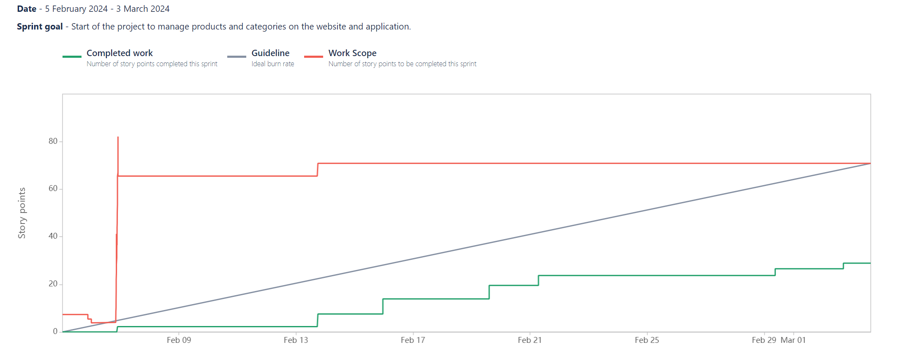

# Sprint N°2 [05/02/2024 - 03/03/2024]

_Start of the project to manage products and categories on the website and application._

## Positive reviews

- Review 1

  - Description: The code has progressed well, and the firsts presentations of the site and application is very positive.
  - Commitment:
    - Said by: Kylian
    - What: Continuing in this direction.
    - When: Until the end of the project.

- Review 2

  - Description: Using Figma really helped us to visualise all the pages and to be consistent in the visuals.
  - Commitment:
    - Said by: Kylian
    - What: Continue to use Figma seriously.
    - When: Until the end of the project.

- Review 3

  - Description: Clear code to help the team progress.
  - Commitment:
    - Said by: Barnabé
    - What: Continue to produce clear, serious code.
    - When: Until the end of the project.

- Review 4

  - Description: Installation of the ORM is finally complete.
  - Commitment:
    - Said by: Cédric
    - What: Remain determined and motivated.
    - When: Until the end of the project.

## Negative reviews

- Review 1

  - Description: Poorly organised distribution of tasks.
  - Consequences: Some tasks are dependent on other tasks, which wastes time in advancing the project.
  - Commitment:
    - Said by: Alix
    - What: Improved management and organisation of task allocation.
    - When: During the next Sprint (#3).

- Review 2

  - Description: Many pull request are open for too long.
  - Consequences: Blocking progress on the project.
  - Commitment:
    - Said by: Barnabé
    - What: Be more attentive to pull requests. Sometimes during the week, to check whether there are requests for open pull requests.
    - When: During the next Sprint (#3).

- Review 3

  - Description: Incomplete task allocation.
  - Consequences: Lack of organisation and user stories not assigned at the end of the Sprint.
  - Commitment:
    - Said by: Barnabé
    - What: Allocation of the three user stories to everyone at the start of the Sprint, for better organisation.
    - When: During the next Sprint (#3).

## Questions

- Question 1

  - Description: Is it possible to increase the maximum number of lines in the linter?
  - Details: 75 lines instead of 50 lines.
  - Said by: Alix

- Question 2

  - Description: Is it possible to find another way of changing the rules for the 2 reviewers when the pull request is open for too long?
  - Details: To avoid wasting too much time.
  - Said by: Barnabé

## Ideas

- Idea 1

  - Description: Better organise the User stories.
  - Commitment:
    - Said by: Kylian
    - What: Include a back-end task and a front-end task in a user story to enable user stories to be independent and better organised.
    - When: The next Sprint (#3).

- Idea 2

  - Description: Modify the site and application logo.
  - Commitment:
    - Said by: Kylian
    - What: Seen with Avetis, the current logo refers more to the buildings than to the furniture.
    - When: The next Sprint, as soon as possible (#3).

- Idea 3

  - Description: Start discussing cart management.
  - Commitment:
    - Said by: Cédric
    - What: Knowing the services and technologies we will be using.
    - When: The next Sprint, before to start writing the user stories (#3).

- Idea 4

  - Description: Start discussing API management.
  - Commitment:
    - Said by: Cédric
    - What: About the documentation.
    - When: The next Sprint, as soon as possible (#3).

## Burnup Report

This overview of the Burnup report allows us to visualise the work accomplished during a sprint and compare it to the total scope of the sprint.

For this second sprint, we can see for the work completed a curve that is slowly rising. We took a long time to finish the ORM setup, which was a real challenge for us. Once the ORM setup was complete, we were able to move on to the other tasks from 13 February.
After that, we increased the number of tasks completed, while keeping the number of points constant.

## Participants

- Barnabé
- Kylian
- Magali
- Cédric
- Alix

